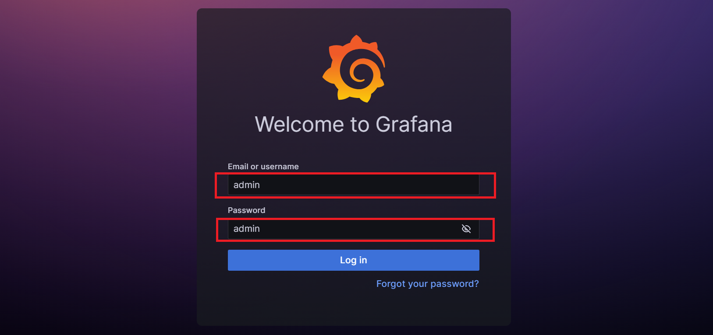

O projeto de integração com mecatrônica tem ênfase na importância e valor que é agregado ao unir a tecnologia em diversas áreas, por isso o nosso projeto visa demonstrar um pouco mais sobre as possibilidades trazidas por essa integração, abaixo é possível ler com mais detalhes sobre.

## Resumo do projeto

- ### Projeto de umidade da planta

  - O projeto visa criar um monitor de umidade do solo em tempo real, permitindo que o usuário monitore sua planta sem a necessidade de observar constantemente a estufa. Quando a umidade do solo está abaixo do nível desejado, um motor é acionado automaticamente para realizar a irrigação, assegurando assim um ambiente propício para o crescimento da planta. Atrelado a isso, tempo uma API dedicada que recebe os dados de umidade do solo e exibe em um dashboard dinâmico e interativo e com a capacidade de envio de alertas de acordo com a necessidade do usuário.

- ### Projeto garrafa d´água

  - O projeto propõe o desenvolvimento de uma garrafa d'água inteligente, equipada com uma célula de carga que constantemente envia dados de peso por meio de requisições HTTP para uma API dedicada. Ao acessar o link da aplicação frontend, o usuário terá à sua disposição um dashboard interativo e em tempo real, atrelado a isso temos uma capacidade de envio de alertas constantes, proporcionando uma experiência dinâmica e informativa sobre o consumo de água.

- ### Link do vídeo
  ```
    https://photos.onedrive.com/share/380CFDB30803ED05!3395?cid=380CFDB30803ED05&resId=380CFDB30803ED05!3395&authkey=!APmgWv4s12oulmw&ithint=video
  ```

## Funcionalidade da API

Receber as solicitações HTTP provenientes do ESP32 e encaminhar as métricas para a biblioteca Prometheus representa uma integração eficiente. A biblioteca Prometheus, por sua vez, oferece um banco de dados dedicado para o armazenamento desses dados, proporcionando uma solução robusta e organizada.

## Tabela de conteúdos

- [Tecnologias utilizadas](#tecnologias-utilizadas)
- [Instalação](#instalacao)
- [Como usar](#como-usar)
- [Contribuições](#contribuicoes)

## Arquitetura

- Container para Front-End, constituído por uma aplicação Grafana.
- Container para Back-End, que envia os dados para o PushGateway.
- Container Prometheus para gerenciamento das métricas enviadas pelo Back-end.
- Container PushGateway que faz a intermediação entre o BackEnd e Prometheus.

## 🛠 Tecnologias Utilizadas

- Python: 3.11.4 (bibliotecas em requirements.txt)
- [Docker](https://www.docker.com): 24.0.6
- Docker-compose: v2.20.2
- Grafana
- Prometheus
- PushGateway

## Requisitos para Uso

- IDE - VScode, PyCharm, etc.
- Conta no Docker.hub
- Versão Atualizada do Windows referente ao WSL 2

## Tutorial de Instalação

O WSL é uma ferramenta que permite rodar programas Linux no Windows. Você deve baixá-lo para fins de desenvolvimento, compatibilidade com aplicativos, uso de ferramentas, compartilhamento de arquivos, e entre outras funcionalidades.

_Vale ressaltar que se você obter Linux em seu sistema operacional, não é necessário instalá-lo._

- [WSL](https://boom-particle-8c8.notion.site/como-instalar-o-wsl2-readme-md-02dcaa42ac7d490bb8f5bb6620669590)

## 💻 Instalação Padrão

- Observação: Execute os comandos a seguir no terminal da sua IDE ou no terminal do seu sitema operacional, as duas formas(abaixo) de instalação devem seguir os passos da `💻Instalação Local`

- 1 - Crie uma pasta:

```
 mkdir mecatron
```

- 2 - Entre na pasta do projeto:

```
 cd mecatron
```

- 3 - Clone o projeto

```
  git clone https://github.com/SergioRicJr/mecatron-observability

```

- 4 - Execute o terminal

* Observação: Será assim caso tenha o VSCode, se não terá que abrir pela própria IDE

```
  code .
```

## 🐋 Execução Docker

- 1 - Entrar na pasta do BackEnd:

```
    cd backend
```

- 2 - Execute o comando abaixo no seu terminal (IDE ou Shell):

```
    docker-compose up
```

- 3 - Abrir um novo terminal na pasta mecatron, e entrar na pasta de frontend

```
    cd frontend
```

- 4 - Executar os containers de Grafana, Prometheus e PushGateway

```
    docker-compose up
```

## Como usar

### API

Para testar o projeto pode ser utilizado o postman, ou qualquer client desejado.

#### Envia dado de peso da garrafa de água

```http
  POST http://127.0.0.1/peso/
```

##### no corpo da requisição:

| Parâmetro | Tipo     | Descrição                                        |
| :-------- | :------- | :----------------------------------------------- |
| `peso`    | `number` | **Obrigatório**. O peso atual da garrafa de água |

#### Envia dado da umidade da terra

```http
  POST http://127.0.0.1/peso/
```

##### no corpo da requisição:

| Parâmetro | Tipo     | Descrição                               |
| :-------- | :------- | :-------------------------------------- |
| `umidade` | `number` | **Obrigatório**. Umidade atual da terra |

### Frontend

Para acessar o dashboard e ter acesso às visualizações dos dados, é necessário acessar no navegador a url: `http://127.0.0.1:3000`

- 1 - No primeiro acesso é necessário realizar o login utilizando para username "admin", e para password "admin", e então redefinir a senha para os próximos acessos.
  

- É possível acessar os dashboards através da navegação lateral, criar, editar e visualizar os que já foram construídos com as diferentes fontes de dados, como Prometheus, Tempo e Loki.
  

## Mobile

Uma ferramenta incrível projetada para incentivar a ingestão de água, permitindo aos usuários acompanhar seu consumo diário e configurar lembretes para se manterem hidratados.

### Tecnologias Utilizadas

- React Native
- Expo

### Pré-requisitos

Antes de começar, certifique-se de ter o Node.js e o npm instalados em sua máquina. Você pode instalá-los a partir do [site oficial do Node.js](https://nodejs.org/).

### Instalação

#### 1. Clone o Repositório

```bash
git clone https://github.com/lucasgearhead/Water-App-Mobile.git
cd Water-App-Mobile
```

#### 2. Instale as Dependências

```bash
npm install
```

### Executando o Aplicativo

#### Com Expo

```bash
npx expo start
```

Isso abrirá a página do Expo DevTools no seu navegador. Você pode escanear o código QR com o aplicativo Expo Go no seu dispositivo móvel ou pressionar a tecla `a` no terminal para iniciar o aplicativo no emulador Android, ou `i` para o emulador iOS.

## Contribuições

- Sergio Ricardo Nascimento:

  - Desenvolvimento do BackEnd, e configuração de containers Grafana, Prometheus e PushGateway.
  - Desenvolvimento do dashboard

- Lucas Dias Custodio da Silva:

  - Desenvolvimento do Figma
  - Desenvolvimento do aplicativo mobile.
  - [Projeto Peso_Agua] Programação completa da placa programável (ESP32), e integração da placa com a api.
  - Edição do vídeo do projeto

- Samuel Nunes:

  - Desenvolvimento da API em DjangoRestFramework
  - Desenvolvimento da documentação do projeto (README.md)

- Vinicius Antunes:
  - Desenvolvimento do Artigo.
  - [Projeto Umidade_Terra] Programação completa da placa programável (ESP32), e integração da placa com a api.
